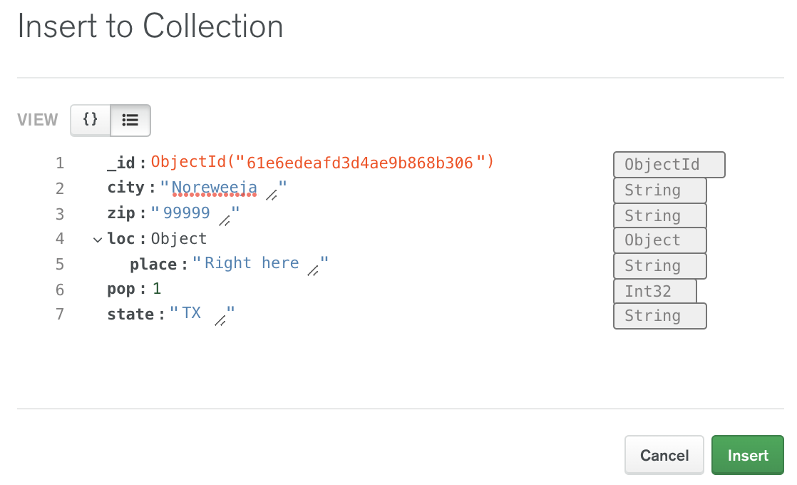

# MongoDB Problem Set #1: Intro to Mongo

--- 

In this problem set, we will exclusively use the Data Explorer,
a GUI provided by MongoDB Atlas. We will practice all the
CRUD operations (Create, Read, Update, and Delete).

If you have not already created a cluster and loaded the
sample dataset onto it, you will need to do so before continuing.

## Problem 1: Queries
On the main page of Atlas, find your cluster and click "Browse
Connections". Open the zips collection in the sample_training
database. Filter for all the documents describing zip codes
in Texas.

<details>
<summary>Hint</summary>

Remember that simple filters follow this format:
``` 
{ "field" : "value" }
```
</details>

<details>
<summary>Solution</summary>

Type this into the filter search bar. 
``` 
{ "state" : "TX" }
```
</details>

## Problem 2: Insert a New Document
In the zips collection, insert a new document
for a new made-up zip code. Take note of which zip 
code you choose, since we need it in the next
problem.

<details>
<summary>Solution</summary>

Please see the image below. You can insert new documents
in the object view or the text view. The text view is shown
below:



Generally, any document you insert should follow the 
same styling of the other documents in that collection.
The screenshot above is missing the correct fields nested
inside the loc object, but it should be enough to give you
the right idea. Remember to click the "Insert" button when you
are ready to insert the new document.
</details>

## Problem 3: Update a Document

Search for the document you just created and update it
to have a new int32 field called "wizard_population".

<details>
<summary>Solution</summary>

Find your document with the zip code you gave it in the
previous problem like this:
```
{ "zip" : "99999" }
```
Then, hover over the result and click on the pencil icon.
Use either the object view or the text view to add a new int32 field
named "wizard_population". Give it whatever value you want
</details>

## Problem 4: Delete a Document

Delete the document you just created by searching for
the number of wizards residing at that zip code.

<details>
<summary>Solution</summary>

Find your document with the zip code you gave it in the 
previous problem like this:
```
{ "wizard_population" : 22 }
```
Then, hover over the result and click on the trash can
icon that appears in the top right.
</details>